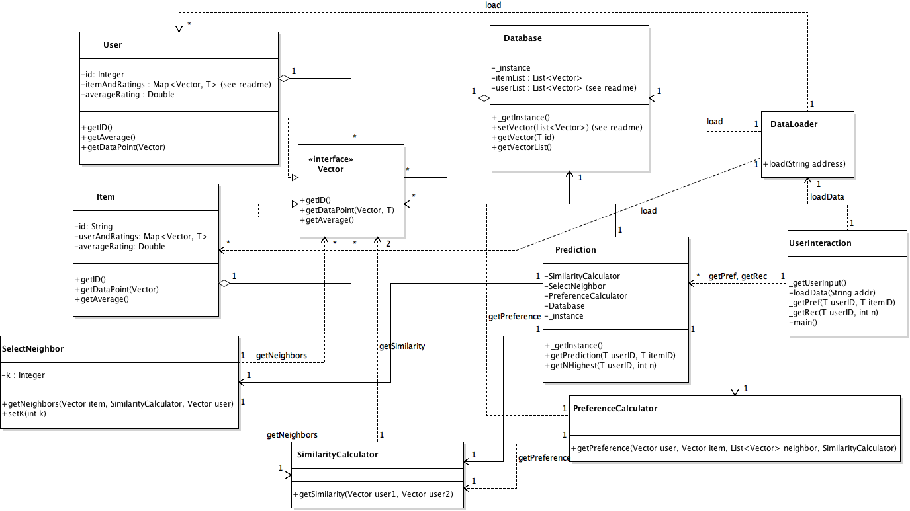

# Collaborative-Filtering-Recommender
Collaborative filtering recommender and predictor that implements kNN with Pearson Correlation and cosine similarity. 

User can load the UserInteraction class and follow the prompted instructions. The system is designed to accommodate the following data sets:
  1. Movie: http://grouplens.org/datasets/movielens/10m/
  2. Movie: http://grouplens.org/datasets/movielens/latest/
  3. Book: http://www2.informatik.uni-freiburg.de/~cziegler/BX/

The recommender system is originally designed as below. Then in order to adapt to other datasets and recommender calculations (e.g. baseline predictor), parts of the design are moderately changed. For example, the UserInteraction class is modified to collect delimiter from users. 

